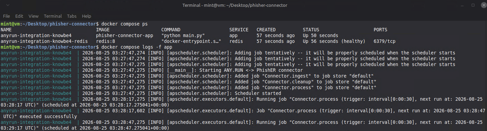
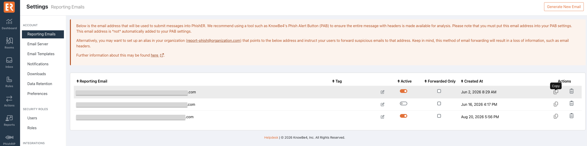
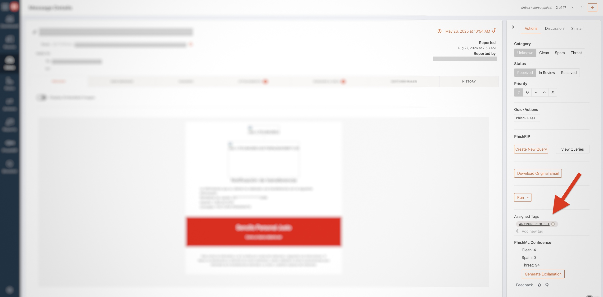
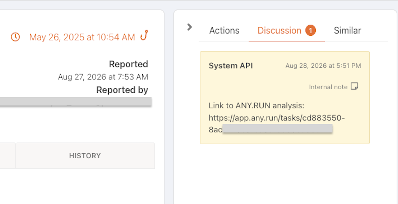
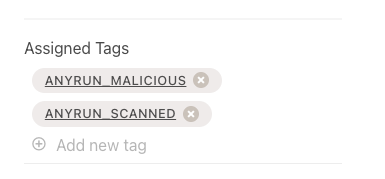

# Integrate ANY.RUN's Interactive Sandbox with Your PhishER Console

Integrate [ANY.RUN's Interactive Sandbox](https://any.run/features/?utm_source=knowbe4&utm_medium=integration&utm_campaign=knowbe4&utm_content=linktosandboxlanding) with PhishER to automatically analyze user-reported emails in an isolated environment and bring analysis results directly into your PhishER workflow.

**Use cases:**

- Automatically analyze suspicious emails reported to PhishER
- Access the analysis from the PhishER message card as soon as it starts
- Investigate threats interactively in real time or wait for the automated report
- Automatically categorize malicious emails as threats

**SOC benefits:**

- Start investigating immediately without waiting for analysis to finish
- Triage suspicious emails faster with real-time behavioral visibility
- Reduce manual analysis and repetitive steps
- Keep email analysis within the existing PhishER workflow

## Before You Connect ANY.RUN to PhishER

Before connecting [ANY.RUN](https://any.run/?utm_source=knowbe4&utm_medium=integration&utm_campaign=knowbe4&utm_content=linktolanding) to PhishER, make sure you have an ANY.RUN account with Sandbox API access and an ANY.RUN API key.

### Generate an ANY.RUN API Key

- Go to [ANY.RUN](https://app.any.run/)
- Navigate to **Profile > [2] API and Limits > [3] Generate > [4] Copy**


You will also need to create a Product API token to integrate ANY.RUN with PhishER. For instructions, see the [Creating a Product API Token](https://support.knowbe4.com/hc/en-us/articles/10495383627155-Product-API-Overview#h_01HBDX0KNGC7G7ZNH6XBH3NZW0) section of the [Product API Overview](https://support.knowbe4.com/hc/en-us/articles/10495383627155-Product-API-Overview) article.

**Note:** In the **Products** field, select **PhishER**.

Save both credentials somewhere secure and easy to access during setup.

## Architecture

The ANY.RUN connector is a **self-hosted, Docker-based integration** that runs in your organization's environment. This deployment model gives you control over configuration, credentials, updates, and which messages are selected for analysis while keeping deployment and management straightforward.

The connector uses Redis for reliable queue and processing-state management. It communicates with PhishER through the GraphQL API and with [ANY.RUN's Interactive Sandbox](https://any.run/features/?utm_source=knowbe4&utm_medium=integration&utm_campaign=knowbe4&utm_content=linktosandboxlanding) through the Sandbox API.

The connector periodically retrieves eligible PhishER messages marked with the configured ingestion tag and submits them to ANY.RUN for analysis. It uses the message URL provided by PhishER, so the original email is not downloaded or stored by the connector.

Processing consists of three main stages:

1. **Discovery** — Finds eligible messages and adds them to the processing queue.
2. **Analysis** — Submits queued messages to ANY.RUN, adds a link to the analysis report as soon as analysis starts, and returns status and verdict information to PhishER as tags and comments.
3. **Recovery** — Identifies interrupted or expired tasks, restores incomplete processing states, and marks timed-out messages in PhishER.

For malicious messages, the connector can also automatically set the PhishER category to **Threat**. Processing takes the available ANY.RUN analysis capacity into account and supports multiple concurrent analysis tasks.

## Configure and Start the Connector

To get started, download the connector, then follow the instructions below to configure and start it:

1. Clone the connector package to the system where it will run, then extract the package.

  ```bash
  git clone git@github.com:anyrun/anyrun-integration-knowbe4.git
  ```

2. In the extracted connector folder, make a copy of `.env.example` and name the copy `.env`.
3. Open `.env` in a text editor.
4. Enter the regional PhishER Product API endpoint in `PHISHER_ENDPOINT`. Use the [base URL for your KnowBe4 account's region](https://developer.knowbe4.com/graphql/phisher/page/Base-URL).
5. Enter the Product API token you created in `PHISHER_API_TOKEN`.
6. Enter your ANY.RUN Sandbox API key in `ANYRUN_API_KEY`.
7. Review the optional settings in the table below, then save the file.
8. From the connector folder, run the following command:

   ```bash
   docker compose up -d --build
   ```

9. Confirm that both services are running:

   ```bash
   docker compose ps
   ```

10. If you need to review connector activity, run the following command:

    ```bash
    docker compose logs -f app
    ```

<br>



*Example of a successfully running ANY.RUN connector.*

### Configuration Settings

The tables below list all environment variables supported by the connector. Update these values in the `.env` file before starting the connector.

#### Main Settings

| Setting | Default | Description |
|---|---|---|
| `PHISHER_ENDPOINT` | *(required)* | PhishER GraphQL [API endpoint](https://developer.knowbe4.com/graphql/ksat/page/Base-URL). For example: `https://ca.knowbe4.com/graphql` |
| `PHISHER_API_TOKEN` | *(required)* | Product API token used to authenticate the connector with PhishER. |
| `ANYRUN_API_KEY` | *(required)* | API key used to authenticate the connector with ANY.RUN's Interactive Sandbox. |

#### Proxy Settings

| Setting | Default | Description |
|---|---|---|
| `HTTP_PROXY` | *(empty)* | Routes requests to PhishER and ANY.RUN through a proxy. Use the format `http://[username:password@]host:port`. Leave empty to connect directly. |

#### PhishER Settings

| Setting | Default | Description |
|---|---|---|
| `INGESTION_TAG` | `ANYRUN_REQUEST` | Tag that identifies messages for analysis. If empty, the connector processes all eligible unresolved messages that have not already been handled by the connector. |
| `PHISHER_MESSAGE_FILTER` | *(empty)* | Optional additional Lucene filter applied together with `INGESTION_TAG`. Leave empty to apply no additional filtering. |
| `SET_CATEGORY_ON_MALICIOUS` | `true` | Sets the PhishER message category to **Threat** when ANY.RUN returns a malicious verdict. |
| `PHISHER_REQUEST_TIMEOUT` | `30` | Maximum time, in seconds, to wait for a response from the PhishER API. |

#### ANY.RUN Base Settings

| Setting | Default | Description |
|---|---|---|
| `ANYRUN_ROOT_URL` | `any.run` | ANY.RUN root domain used for API requests and links to analysis reports. |

#### ANY.RUN Analysis Options

| Setting | Default | Description |
|---|---|---|
| `ANYRUN_OPT_TIMEOUT` | `240` | Maximum analysis duration in seconds. Supported range: `10`-`1200`. |
| `ANYRUN_PRIVACY_TYPE` | `bylink` | Analysis privacy level. Supported values: `public`, `bylink`, `owner`, and `byteam`. Availability depends on your ANY.RUN plan. |
| `ANYRUN_OPT_NETWORK_CONNECT` | `true` | Enables network access in the analysis environment. |
| `ANYRUN_OPT_NETWORK_FAKENET` | `false` | Enables FakeNet network simulation. |
| `ANYRUN_TOR` | `false` | Routes analysis traffic through the Tor network. |
| `ANYRUN_GEO` | `fastest` | Selects the Tor exit-node location. Use `fastest` or an available country code such as `US`. |
| `ANYRUN_MITM` | `false` | Enables HTTPS traffic inspection using the ANY.RUN MITM proxy. |
| `ANYRUN_RESIDENTIAL_PROXY` | `false` | Routes analysis traffic through an ANY.RUN residential proxy. |
| `ANYRUN_RESIDENTIAL_PROXY_GEO` | `fastest` | Selects the residential proxy location. Use `fastest` or an available country code. |
| `ANYRUN_VERDICT_RETRY_ATTEMPTS` | `5` | Number of attempts to retrieve the verdict after the analysis has finished. |
| `ANYRUN_VERDICT_RETRY_DELAY_SECONDS` | `10` | Delay, in seconds, between verdict retrieval attempts. |

#### ANY.RUN Analysis Object Settings

| Setting | Default | Description |
|---|---|---|
| `ANYRUN_OBJ_EXT_EXTENSION` | `true` | Automatically corrects the analyzed file's extension when necessary. |

#### ANY.RUN Analysis Environment Settings

| Setting | Default | Description |
|---|---|---|
| `ANYRUN_ENV_LOCALE` | `en-US` | Language and regional settings of the analysis environment. |
| `ANYRUN_OS_TYPE` | `windows` | Operating system used for analysis. Supported values: `windows`, `linux`, and `macos`. |
| `ANYRUN_ENV_VERSION` | `10` | Operating system version. Windows supports `7`, `10`, `11`, and `server 2025`. Linux supports `ubuntu`, `debian`, or compatible version values such as `22.04.2` and `12.2`. |
| `ANYRUN_ENV_BITNESS` | `64` | Windows environment architecture. Supported values: `32` and `64`. |
| `ANYRUN_ENV_TYPE` | `complete` | Windows environment preset. Supported values: `complete` and `development`. The `development` preset is available only for Windows 10 x64. |
| `ANYRUN_OBJ_EXT_STARTFOLDER` | `temp` | Folder from which the analyzed object is started. Supported values depend on `ANYRUN_OS_TYPE`. |
| `ANYRUN_OBJ_EXT_CMD` | *(empty)* | Optional command-line arguments passed to the analyzed object. Leave empty to use the standard behavior. |
| `ANYRUN_OBJ_FORCE_ELEVATION` | `false` | Requests elevated privileges for supported Windows files. This option is not currently supported by the installed SDK version and is ignored. |
| `ANYRUN_AUTOMATED_INTERACTIVITY` | `true` | Enables automated interaction with the analyzed object. |
| `ANYRUN_RUN_AS_ROOT` | `false` | Requests superuser privileges in Linux. This option is not currently supported by the installed SDK version and is ignored. |

Allowed values for `ANYRUN_OBJ_EXT_STARTFOLDER`:

| Operating system | Supported folders |
|---|---|
| Windows | `desktop`, `home`, `downloads`, `appdata`, `temp`, `windows`, `root` |
| Linux | `desktop`, `home`, `downloads`, `temp` |
| macOS | `desktop`, `home`, `downloads`, `temp` |

#### Redis Settings

| Setting | Default | Description |
|---|---|---|
| `REDIS_HOST` | `redis` | Hostname of the Redis service used by the connector. |
| `REDIS_PORT` | `6379` | Redis service port. |
| `REDIS_DB` | `0` | Redis database number used by the connector. |

#### Job Settings

| Setting | Default | Description |
|---|---|---|
| `DISCOVERY_INTERVAL_SECONDS` | `300` | How often the connector checks PhishER for new messages, in seconds. |
| `QUEUE_INTERVAL_SECONDS` | `30` | How often the connector checks the processing queue and attempts to submit messages to ANY.RUN, in seconds. |
| `CLEANUP_INTERVAL_SECONDS` | `300` | How often the connector checks for expired or stuck queue entries, in seconds. |
| `PROCESS_JOB_MAX_INSTANCES` | `50` | Maximum number of processing job instances that can run concurrently. |
| `QUEUE_TIMEOUT_SECONDS` | `3600` | Maximum time, in seconds, that a message may remain queued or in progress before it is marked as timed out. |
| `QUEUE_SAFETY_TTL_SECONDS` | `3600` | Redis expiration time, in seconds, for queue and in-progress records. |
| `PROCESSED_TTL_SECONDS` | `3600` | How long, in seconds, processed-message records are retained in Redis. |
| `DISCOVERY_PER_PAGE` | `200` | Maximum number of PhishER messages requested per discovery page. |
| `QUEUE_PER_PAGE` | `50` | Maximum number of queued messages handled in one processing batch. |
| `MAX_DISCOVERY_PAGES` | `3` | Maximum number of PhishER result pages checked during each discovery cycle. |

#### Runtime and Logging Settings

| Setting | Default | Description |
|---|---|---|
| `LOG_LEVEL` | `INFO` | Logging detail level, for example `DEBUG`, `INFO`, `WARNING`, or `ERROR`. |
| `LOG_DIR` | `logs` | Directory where the connector stores its log files. |
| `LOG_MAX_BYTES` | `10485760` | Maximum size of each log file before rotation. The default is 10 MB. |
| `LOG_BACKUP_COUNT` | `2` | Number of rotated copies retained in addition to the active log file. |

Important: Do not share the `.env` file. It contains credentials that provide access to your PhishER and ANY.RUN accounts.

## Submit a PhishER Message to ANY.RUN

After the connector is running, you can submit suspicious emails from PhishER to ANY.RUN for analysis by following the steps below.

### Submit an Email to PhishER

1. Log in to your PhishER console.
2. Select the **Settings** icon in the lower-left corner of the dashboard.
3. Navigate to **Reporting Emails**.
4. Copy an existing reporting email address or generate a new one.
5. Using your preferred email client or Phish Alert Button (PAB), send or forward the suspicious email to the reporting address.
6. Allow time for PhishER to ingest and process the message. When processing is complete, the message appears in the **Inbox**.



*Copy the PhishER reporting email address used to submit suspicious messages.*

### Submit the Message to ANY.RUN

By default, the connector only submits messages carrying the `ANYRUN_REQUEST` tag.

1. Navigate to the **Inbox** in the PhishER console.
2. Open the message you want to analyze.
3. Apply the `ANYRUN_REQUEST` tag. If your organization changed the `INGESTION_TAG` setting, apply the configured tag instead.
4. Wait for the connector to pick up the message and submit it to ANY.RUN.



*Apply the ANYRUN_REQUEST tag to submit the message to ANY.RUN.*

The connector monitors the PhishER Inbox at the interval configured by `DISCOVERY_INTERVAL_SECONDS`, so applying the tag manually after PhishER processing is supported and does not need to trigger a PhishER action. After the message enters the connector's processing queue, the request tag is removed automatically.

### Choose Which Messages Are Analyzed

You can configure the submission workflow in one of the following ways:

- **Manual submission:** Keep `INGESTION_TAG=ANYRUN_REQUEST` and apply the tag manually to individual messages.
- **Automatic submission by rule:** Create a PhishER rule and action that applies the `ANYRUN_REQUEST` tag during initial PhishER processing when a message meets your organization's criteria.
- **Submit all eligible messages:** Leave `INGESTION_TAG` empty. The connector will submit all processed, unresolved messages that it has not already handled.
- **Apply more specific criteria:** Configure `PHISHER_MESSAGE_FILTER` with an additional Lucene query. When `INGESTION_TAG` is also configured, a message must match both the tag and the additional filter. If `INGESTION_TAG` is empty, the additional filter determines which eligible messages are submitted.


## View the Analysis Results in PhishER

You don't have to wait for the analysis to finish to start investigating. As soon as the connector submits a message to ANY.RUN, it adds a comment with a link to the full analysis report in the **Discussion** panel. You can open the link while the analysis is running to investigate interactively in real time, or simply wait for ANY.RUN to complete the analysis automatically.

You can also monitor the analysis status through the message's tags.



*Open the link in the Discussion panel to view the analysis in ANY.RUN.*

After the analysis is complete, the message will have the `ANYRUN_SCANNED` tag and one of the following verdict tags:

- `ANYRUN_MALICIOUS`: ANY.RUN detected malicious activity. If `SET_CATEGORY_ON_MALICIOUS` is enabled, the message category is also changed to **Threat**.
- `ANYRUN_SUSPICIOUS`: ANY.RUN detected suspicious activity.
- `ANYRUN_CLEAN`: ANY.RUN did not identify a specific threat.

To review the full analysis report, open the message and select the **Discussion** panel. The connector adds a link to the ANY.RUN report and a separate comment containing the verdict. Your ability to open the report depends on the privacy setting used for the analysis and your access to the ANY.RUN account.



*Example of the analysis status and final ANY.RUN verdict displayed on a message in PhishER.*

## ANY.RUN Connector Tags

The connector uses the following tags to show the status and result of an analysis:

| Tag | Description |
| --- | --- |
| `ANYRUN_REQUEST` | Requests an ANY.RUN analysis. This is the default trigger tag and is removed after the message is queued. |
| `ANYRUN_QUEUED` | The message is waiting to be submitted. If all ANY.RUN parallel task slots are in use, the message remains queued and the connector retries automatically. |
| `ANYRUN_PENDING` | The message has been submitted and the connector is waiting for the result. |
| `ANYRUN_SCANNED` | The analysis completed successfully. This tag is added with a verdict tag. |
| `ANYRUN_MALICIOUS` | ANY.RUN detected malicious activity. |
| `ANYRUN_SUSPICIOUS` | ANY.RUN detected suspicious activity. |
| `ANYRUN_CLEAN` | ANY.RUN did not identify a specific threat. |
| `ANYRUN_ERROR` | The connector could not submit the message or retrieve the result. Open the **Discussion** panel for details. |
| `ANYRUN_TIMEOUT` | The message remained in the connector's internal queue longer than the configured timeout. Open the **Discussion** panel for details. |

## Logging

Console output is colored by subsystem: `apscheduler` (green), `anyrun_connector`
(blue), `phisher` (orange). Everything is also written to rotating files under
`LOG_DIR`:

- `scheduler.log` — everything from the `apscheduler` logger tree
- `app.log` — everything else (phisher, anyrun_connector, connector, main)

Each file rotates at `LOG_MAX_BYTES` and keeps `LOG_BACKUP_COUNT` old copies
plus the active file. See [`src/logging_setup.py`](src/logging_setup.py).

## Running locally

```bash
uv sync                 # installs runtime deps (see Testing below for dev deps)
cp .env.example .env    # fill in PHISHER_API_TOKEN and ANYRUN_API_KEY
```

You need a reachable Redis (`docker run -p 6379:6379 redis:8` works for local
dev) and `REDIS_HOST=localhost` in `.env`.

`src/*.py` use flat imports (`from const import ...`, not
`from src.const import ...`). Run it as a script from the repo root — Python
automatically adds a script's own directory to `sys.path`, so this satisfies
the flat imports without needing `cd src` first. That matters: `LOG_DIR`
(default `logs`) is resolved relative to the current working directory, so
running from the repo root is also what puts log files in `./logs` instead of
`./src/logs`.

```bash
uv run --env-file .env src/main.py
```

## Docker

`docker-compose.yml` runs two services: `app` (this connector) and `redis:8`
with an `appendonly` data volume. The Dockerfile copies `src/` flattened
directly into `/app` (so the same flat-import style works unmodified) and
runs as a non-root `connector` user.

```bash
docker compose up -d --build
docker compose logs -f app
```

Log files land in `./logs` on the host via a bind mount (not a named Docker
volume), so `logs/scheduler.log` / `logs/app.log` are just regular files in
the project directory.

## Testing

```bash
uv run pytest
```

Tests live in [`tests/`](tests/) and mock everything external — Redis via
[`fakeredis`](https://github.com/cunla/fakeredis-py), PhishER's
`requests.Session`, and ANY.RUN's `SandboxConnector` — so the suite needs no
live server, PhishER account, or ANY.RUN account.

Test/dev-only dependencies (`pytest`, `pytest-cov`, `fakeredis`) live under
`[dependency-groups] dev` in `pyproject.toml` (PEP 735), not
`[project.dependencies]`. The Dockerfile's `pip install .` only ever
resolves `[project.dependencies]`, so none of this leaks into the image.

Coverage report:

```bash
uv run pytest --cov --cov-report=term-missing
# or, for an interactive line-by-line HTML report:
uv run pytest --cov --cov-report=html   # see htmlcov/index.html
```

## Troubleshooting

If a message is not analyzed, review the following common issues:

- **The request tag has no effect:** Confirm that the connector services are running. The message must have completed PhishER processing, must not be resolved, and must not already have an `ANYRUN_*` status or result tag.
- **The message remains queued:** Your ANY.RUN account may not have an available parallel task slot. The connector will retry automatically when a slot becomes available.
- **The message has an `ANYRUN_ERROR` tag:** Open the message's **Discussion** panel for the error details. Confirm that both API credentials are valid, the Product API token is enabled and has not expired, the regional PhishER endpoint is correct, and the host can connect to PhishER and ANY.RUN.
- **The message has an `ANYRUN_TIMEOUT` tag:** Confirm that the connector and Redis services are running, then review the connector logs for interruptions or connectivity issues.
- **The report link cannot be opened:** Confirm that the viewer has the access required by the configured ANY.RUN privacy type.

For additional help with the integration, contact [ANY.RUN support](https://app.any.run/contact-us?utm_source=knowbe4&utm_medium=integration&utm_campaign=knowbe4&utm_content=linktocontactus).
